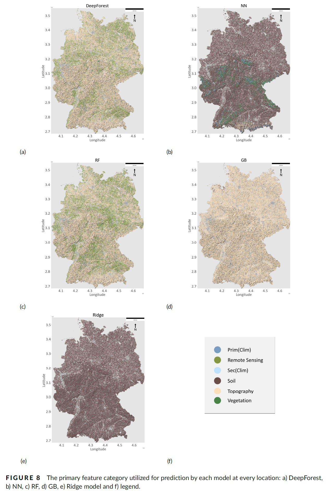

# XAI-for-SOC-models
Explainable AI for Soil Organic Carbon (SOC) Predcition Ml/DL Models 

This repository contains codes associated with the manuscript titled:

> **"Towards Explainable AI: Interpreting Soil Organic Carbon Prediction Models Using a Learning-Based Explanation Method with Environmental Data."**

Submitted to: *European Journal of Soil Science* (EJSS)

## Usage

1. To access the LUCAS topsoil dataset (ground truth), visit: [LUCAS Topsoil Dataset](https://esdac.jrc.ec.europa.eu/content/topsoil-physical-properties-europe-based-lucas-topsoil-data)
2. For the base code to download and climate data (input features for ML models), please refer to: [SoilNet GitHub Repository](https://github.com/moienr/SoilNet)

3. The methodolgy for XAI is heavily based on [CXplain](https://github.com/d909b/cxplain). Please install related conda packages and make sure of the compability of the versions. 

This repository will be updated gradually. Meanwhile, do not hesitate to contact me via: nafiseh.kakhani@uni-tuebingen.de

